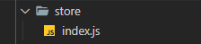
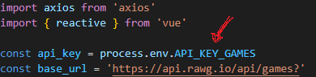

# Game Master 🎮🎮
<br/>

<h1>Estudo feito para requisição de API<h1>

### Função:
```
Buscar nome informações de jogos.
```


<br/>

### IMPORTANTE! :

 <p style="background-color: #111; padding: 1rem; border-radius: 10px">
    Não deixei disponivel a api key desse projeto, então caso queira <br/> 
    testar em seu computador, entre no site <a href="https://rawg.io/apidocs">https://rawg.io/apidocs</a> e pegue sua propria key.<br/>
    Depois basta substituir o valor da variável api_key que esta no arquivo index na pasta store. 
 </p>

<div style="display:flex; align-items: center; justify-content: space-evenly;">


</div>

## Project setup
```
npm install
```

### Compiles and hot-reloads for development
```
npm run serve
```

### Compiles and minifies for production
```
npm run build
```

### Customize configuration
See [Configuration Reference](https://cli.vuejs.org/config/).
